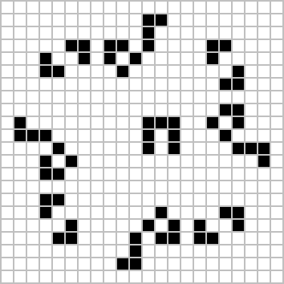

# README #
*2/03/2021 - 10/03/2021*  

>Copyright [2020] (Alejandro Ramirez Larena copyright)
Licensed under the Apache License, Version 2.0 (the "License");
you may not use this file except in compliance with the License.
You may obtain a copy of the License at
http://www.apache.org/licenses/LICENSE-2.0
Unless required by applicable law or agreed to in writing, software
distributed under the License is distributed on an "AS IS" BASIS,
WITHOUT WARRANTIES OR CONDITIONS OF ANY KIND, either express or implied.
See the License for the specific language governing permissions and
limitations under the License.  

**Trabajo Programacion II**

### Proyecto II ###

-El programa genera es capaz de simular el juego de la vida.

-Implementa la generacion de una matriz por montecarlo y tambien la importacion de una matriz custom.

### Comandos para compilar y generar javadoc ###

-He usado MAVEN entonces los comandos para compilar son los usados en MAVEN 

### Ejemplo del juego de la Vida ###

### Como usar ###
-Para iniciar el juego hay que establecer un modo de juego:
- 0 Genera una matriz aleatoria por Montecarlo
- 1 Genera la nave 1
- 2 Genera la nave 2
- 3 Genera la matriz introducida en el fichero matriz.txt 

-Luego hay que introducir un numero de estados que queremos generar.

### Comandos y ejemplos de uso ###
-De esta forma se genera la matriz por Montecarlo y se dan 10 estados: java -jar target/Juego_de_la_vida-1.0-SNAPSHOT-jar-with-dependencies.jar 0 10

-Para eso tambien se puede usar make normal

### Realizado por:

Alejandro Ramirez Larena  
 

### Diagrama UML###

-Este es el digrama creado con Umbrello de el programa.  

 

